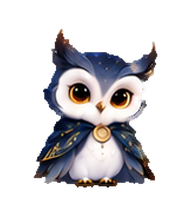

# Sol & Luna · 日月猫头鹰

我给 Codex 做了一对猫头鹰桌宠。一个像晨光，一个像月夜，在桌面一角陪你工作。

A pair of owl companions for Codex — a little sunshine, a little moonlight, and company while you work.

[中文](#开始使用) · [English](#english) · **[下载安装包 / Download](https://github.com/aychdong/sol-luna-owls/releases/download/v1.1.0/Sol-Luna-v1.1.0-install.zip)** · [试试看 / Live preview](https://aychdong.github.io/sol-luna-owls/) · [一页图解 / Quick guide](media/sol-luna-quick-guide.png)

*角色设定图 / Character concept art. 下面是安装后的实际动画 / Actual pet animations below.*

| Sol · 晨光 | Luna · 月夜 |
|:---:|:---:|
|  |  |
| 暖灰羽毛，太阳徽章，金色月桂纹 | 冷色羽毛，月亮饰件，点点星纹 |
| Warm gray feathers · sun medallion · golden laurels | Cool feathers · crescent clasp · embroidered stars |

## 开始使用

适用于支持自定义宠物的 **Codex macOS 桌面版**。安装后，它会浮在桌面上；你可以任选一只、拖到喜欢的位置。

1. **下载并解压**上方安装包，得到 `sol` 和 `luna` 两个文件夹。
2. **放入宠物目录。** Finder 按 **⌘ ⇧ G**，输入 `~/.codex/pets/`，把两个文件夹复制进去。目录不存在时，先进入 `~/.codex/`，新建 `pets` 文件夹。
3. **选择并唤醒。** 打开 Codex **设置 → 宠物**，刷新列表，选择 **Sol · 晨光** 或 **Luna · 月夜**，再点击唤醒／显示宠物。

无需运行代码。已有同名宠物时，先将旧文件夹移到别处备份。[详细安装、更新与卸载说明](docs/INSTALL.md)。

## 它会做什么？

| 你在做什么 | 小猫头鹰的反应 |
|---|---|
| 暂时没有任务 | 安静待机，转头陪伴 |
| 鼠标悬停在它身上 | 扑翅轻跃 |
| 向左或向右拖动它 | 朝对应方向跑步 |
| Codex 正在工作 | 敲电脑 |
| 任务需要你回应 | 等候 |

还有招手、受挫、拿书审阅和不同方向的视线。可以在[在线预览](https://aychdong.github.io/sol-luna-owls/)中查看全部动作。实际播放由应用状态与设置决定；网页中选择一个动作，不会控制桌面上的宠物。

| 扑翅轻跃 | 朝右跑步 | 敲电脑 | 拿书审阅 |
|:---:|:---:|:---:|:---:|
|  |  |  |  |

## FAQ

**下载哪一个文件？** 只想安装，选择上方的 `Sol-Luna-v1.1.0-install.zip` 即可，不需要下载整个仓库。想先看看，打开在线预览或[一页图解](media/sol-luna-quick-guide.png)。

**复制后找不到 Sol / Luna？** 检查是否多套了一层文件夹：正确位置是 `~/.codex/pets/sol/pet.json`，旁边有 `spritesheet.webp`。刷新宠物列表；仍不显示时，完整退出 Codex 后重开。若设置中没有宠物入口，请先检查应用更新。

**能同时显示两只，或自动日夜切换吗？** 这是一套可供选择的两只宠物。本项目不提供同时显示或自动切换功能，请在应用中手动选择。

**为什么没见到某个动作，或者眼神没有跟着光标？** 动作触发由应用控制，随版本和任务状态可能不同。预览页能展示全部素材，但不保证每种动作都会在你的使用场景中出现。启用“减少动态效果”也可能让动画显示为静态。

**如何更新、回退或卸载？** 更新时先备份旧的 `sol`、`luna`，再复制新版。需要回退时，用自己的备份或[发布页中的回退包](https://github.com/aychdong/sol-luna-owls/releases/tag/v1.1.0)替换。卸载时先切换其他宠物，再移走这两个文件夹即可。

**网页版或 Windows 能用吗？** 这里提供的是桌面宠物文件夹，安装说明已按 macOS 整理。网页上传宠物的方式和格式不同，请勿直接套用；Windows 的安装过程暂未在本项目中验证。

## English

**Sol** wears warm gray feathers, a sun medallion and golden laurels. **Luna** wears cool feathers, a crescent clasp and embroidered stars. Choose one to float beside your work in the **Codex macOS desktop app with custom-pet support**.

### Install in three steps

1. Download and extract the [install ZIP](https://github.com/aychdong/sol-luna-owls/releases/download/v1.1.0/Sol-Luna-v1.1.0-install.zip).
2. In Finder, press **⌘ ⇧ G**, open `~/.codex/pets/`, and copy in **sol** and **luna**. If the directory is missing, open `~/.codex/` and create a `pets` folder. Back up any existing folders with those names first.
3. In **Settings → Pets**, refresh, select **Sol** or **Luna**, then **Wake / Show pet**.

No scripts are needed. [Detailed installation, updates and removal](docs/INSTALL.md#english).

### Meet your companion

Hover to see a little wing-flapping hop; drag left or right to see it run. It types while Codex works and waits when a task needs your response. The artwork also includes waving, book review, setbacks and different gaze directions. Explore them in the [interactive preview](https://aychdong.github.io/sol-luna-owls/). The app decides which animations to trigger; preview controls do not control your installed pet.

### FAQ

- **Which download?** Choose `Sol-Luna-v1.1.0-install.zip`. You do not need the whole repository.
- **Not appearing?** Make sure `pet.json` and `spritesheet.webp` are directly inside `~/.codex/pets/sol/` and `luna/`. Refresh, then fully quit and reopen the app if needed. Check for app updates if Pets is absent from Settings.
- **Both at once, or automatic day/night switching?** This project supplies two selectable pets, not those additional features. Switch manually in the app.
- **Missing an animation or cursor tracking?** Triggers depend on the app version, task state and motion settings. The preview displays the available artwork; not every animation is guaranteed to trigger in every situation.
- **Update, roll back or remove?** Back up before replacing the two folders. Restore your backup or a rollback package from the [release page](https://github.com/aychdong/sol-luna-owls/releases/tag/v1.1.0). To remove them, choose another pet, then move the two folders out.
- **Web or Windows?** These are desktop pet folders with macOS instructions. Web uploads use a different workflow and format; Windows installation has not been verified for this project.

---

个人艺术创作，非 OpenAI 官方产品。当前版本 **v1.1.0**；尚未授予开源许可。

Personal artwork, not an official OpenAI product. Current version: **v1.1.0**. No open-source license has been granted.
