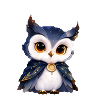

# Sol & Luna · 日月猫头鹰

[中文](#中文) · [English](#english) · [交互预览 / Live preview](https://aychdong.github.io/sol-luna-owls/) · [v1.1.0 下载 / Downloads](https://github.com/aychdong/sol-luna-owls/releases/tag/v1.1.0)

| Sol · 晨光 | Luna · 月夜 |
|:---:|:---:|
|  |  |

## 中文

当前正式版 **v1.1.0 = 原始 V1 + 已批准的 R4 视线修复**。Sol 保留 V1 暖灰羽色，Luna 保留 V1 深冷蓝羽色，两只均沿用原版形态与饰件。待机、左右侧跑、招手、轻跃、受挫、等待、工作和检视全部保留 V1 像素，不采用中间 V6–V10 的改版动作。

视线修复包含：向上、向下的双侧眉羽；向下看的近圆形眼睛；明确区分第 10、11、12 帧的左下角度和第 14、15 帧的左上角度。本次 R4 审阅通过后直接发布，未再重画。

### 安装

1. 下载 [Sol-Luna-v1.1.0-install.zip](https://github.com/aychdong/sol-luna-owls/releases/download/v1.1.0/Sol-Luna-v1.1.0-install.zip) 并解压。
2. 先备份已有的同名宠物文件夹。Finder 按 **⌘ ⇧ G**，输入 `~/.codex/pets/`。
3. 把 **sol、luna 两个文件夹**复制进去，重新选择宠物；仍显示旧图时完整退出应用再打开。

每个文件夹直接包含 `pet.json` 和 `spritesheet.webp`，不需要运行脚本。[安装与回退说明](docs/INSTALL.md)。

### 预览与下载

- [在线交互预览](https://aychdong.github.io/sol-luna-owls/)：中英双语、全部 V1 动作、16 方向、R3/R4 对照、逐帧、慢放、96px/放大、深浅背景。
- [单文件离线预览](https://github.com/aychdong/sol-luna-owls/releases/download/v1.1.0/Sol-Luna-v1.1.0-offline-preview.html)：下载后直接打开。
- [完整交付包](https://github.com/aychdong/sol-luna-owls/releases/download/v1.1.0/Sol-Luna-v1.1.0-delivery.zip)：安装文件、离线预览和操作说明。
- [Release 附件](https://github.com/aychdong/sol-luna-owls/releases/tag/v1.1.0)：原始 V1、R3 回退包、完整历史素材及 SHA-256 校验清单。

### 验证与素材

两只各使用 **1536 × 2288** 的透明无损 WebP，8 × 11 格，每格 192 × 208。正式包的四个文件与批准的 R4 完全一致；每只前九行动作的 **72 格与 V1 一致**；相对 R3 只替换五个视线格，其余 **83 格一致**。安装 ZIP、动画时长及预览控件已检查。原生应用事件触发本轮未重新实测；网页方向循环是审阅工具。

`pets/` 为当前安装版；`assets/approved/` 为不可变的批准输入，`assets/sources/` 与 `assets/prompts/` 保留相关修图素材和提示词；`docs/` 记录流程，`reports/` 记录校验。完整试作、快照和旧版本保存在 Release 的历史 ZIP，未删除。[项目结构与重建](docs/PROJECT.md) · [验证报告](reports/package-validation.json)。

## English

**v1.1.0 is original V1 plus the approved R4 gaze repairs.** Sol retains the warm-gray V1 palette; Luna retains the deep cool-blue V1 palette, with their original proportions and ornaments. Idle, left/right side-running, wave, hop, failure, waiting, work and book review preserve the original V1 pixels. Intermediate V6–V10 action redesigns are not used.

Repairs restore paired brow plumes for up/down gaze, near-round eyes for downward gaze, three distinct down-left poses (10–12) and two up-left poses (14–15). The approved R4 artwork is published directly without further generation.

### Install

Download the [install ZIP](https://github.com/aychdong/sol-luna-owls/releases/download/v1.1.0/Sol-Luna-v1.1.0-install.zip). Back up existing pet folders. In Finder, press **⌘ ⇧ G**, open `~/.codex/pets/`, and copy in the extracted **sol** and **luna** folders. Each contains `pet.json` and `spritesheet.webp`. Select the pet again; fully quit and reopen the app if cached artwork persists. No scripts are required. [Installation and rollback](docs/INSTALL.md).

The [bilingual preview](https://aychdong.github.io/sol-luna-owls/) includes all V1 actions, 16 directions, R3/R4 comparisons, frame stepping, slow playback, desktop-size/enlarged views and light/dark backgrounds. [Release downloads](https://github.com/aychdong/sol-luna-owls/releases/tag/v1.1.0) include the standalone offline preview, full delivery, original V1 and R3 rollbacks, complete historical materials, and checksums.

Both transparent lossless atlases are 1536 × 2288, with 88 cells of 192 × 208. The four install files are byte-identical to approved R4. All 72 action cells per owl match original V1; only five gaze cells differ from R3, leaving 83 cells unchanged. Package contents, animation timing and preview controls are checked. Native application event triggers have not been retested in this release; the web direction loop is a review tool.

`pets/` is the current installable release; `assets/approved/` is its immutable input. `assets/sources/` and `assets/prompts/` retain generation materials. Complete historical trials and snapshots are preserved in the Release source-history ZIP. [Project workflow](docs/PROJECT.md) · [Validation](reports/package-validation.json).

Personal artwork, not an official OpenAI product. No open-source license has been granted. / 本项目是个人艺术创作，并非 OpenAI 官方产品；尚未授予开源许可。
