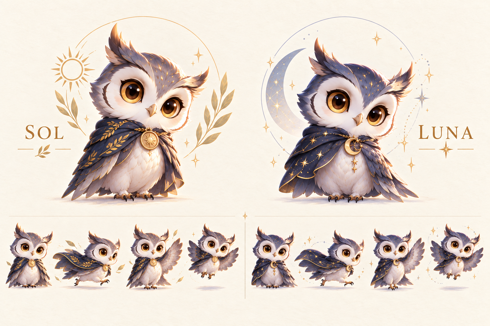

# Sol & Luna · 日月猫头鹰

[中文](#中文介绍) · [English](#english)



## 中文介绍

**Sol & Luna** 是为 ChatGPT CodeX 桌面版 设计的一对日夜猫头鹰桌宠：白天的 **Sol** 与夜间的 **Luna**。Sol 在拉丁语中是表示太阳的阳性名词，Luna 表示月亮。

在希腊神话中，一只小猫头鹰（纵纹腹小鸮）代表着智慧女神雅典娜以及她在罗马神话中的化身弥涅耳瓦。由于这种联系，这种鸟通常被称为雅典娜的猫头鹰或密涅瓦的猫头鹰。在整个西方世界它成为知识、智慧、敏锐和博学的象征。

角色保留大头、圆身、短腿、琥珀眼、双侧眉羽和金纹披风，融合手绘羽毛与柔和的立体光影。

### 本次动作升级

| 动作 | 表现 |
| --- | --- |
| Sol 待机 | 好奇观察 → 整理披风 → 抬眼陪伴 |
| Luna 待机 | 整理披风 → 闭眼打盹与小小 z → 慢慢醒来 |
| 思考 → 工作 | 电脑始终在场，目光从屏幕游离、翼尖托腮，再回到敲键盘 |
| 等待输入 | 摊翼邀请，头顶金色问号 |
| 受挫后振作 | 睁大眼、缩肩低头、短暂星点，再恢复精神；双翼收拢 |
| 互动 | 招手、轻跃与持书检视 |
| 视线 | 16 个屏幕方向，保留双侧眉羽 |
| 左右移动 | 保留原版跑步；飞翔试作因翅膀与披风的遮挡不稳定而弃用 |

原生应用提供固定的九组动作槽位。**Thinking 与敲键盘共用工作动画，不能随模型内部思考单独触发**；两种待机活动合成一个循环，不随机选择。日夜外观需手动切换。

### 下载与安装

1. 下载并解压 [安装包 ZIP](sol-luna-final/Sol-Luna-安装包.zip)。
2. 如果已经安装旧版，先把 `~/.codex/pets/sol` 和 `luna` 两个文件夹移到备份位置。
3. 在 macOS Finder 按 **⌘ ⇧ G**，输入 `~/.codex/pets/`，复制新版 `sol`、`luna` 两个文件夹进去。
4. 在桌面应用的宠物选择界面刷新并重新选择 **Sol · 晨光** 或 **Luna · 月夜**。若未更新，完整退出并重新打开应用。

```text
~/.codex/pets/
├── sol/
│   ├── pet.json
│   └── spritesheet.webp
└── luna/
    ├── pet.json
    └── spritesheet.webp
```

无需运行代码，也不需要复制外层文件夹。[旧版安装包](releases/v1/Sol-Luna-安装包.zip) 保留用于回退。

### 双语动画展示

下载项目后打开根目录 **index.html**，或下载 [独立离线预览 HTML](sol-luna-final/预览/动画预览.html)。右上角 **中文 / English** 切换全部界面文字。

展示页支持应用原速、三轮后待机、持续循环、暂停、上一帧／下一帧、16 方向滑块、大小与速度调整、浅深背景和透明边缘检查。单独的 **Thinking** 按钮用于慢速观察托腮细节。页面鼠标跟随仅为检查方向帧；原生应用由输入位置或电脑操作光标等目标驱动，普通鼠标移动不保证触发。

页面无需网络、外部字体或追踪服务。GitHub 文件页显示 HTML 源码，下载后用浏览器打开即可。

### 规格与检查

透明无损 WebP，**1536 × 2288**，**8 × 11** 网格，每格 **192 × 208**。动作行有效帧数为 `6 / 8 / 8 / 4 / 5 / 8 / 6 / 6 / 6`，末两行存放 16 个方向帧。

检查包括逐帧图、格内边界、透明度、无损回读、完整电脑与独立符号、原版跑步像素一致性、ZIP 内容和文件校验清单。帧数、时长和图像格式校验来自本机应用 **26.903.61454**。原生界面的实际选择、事件触发和播放尚未人工验证，不能把展示页的模拟视为原生触发测试。

素材由内置 imagegen 生成，经用户授权使用本地 Python、Pillow 和 NumPy 抠图、对齐与打包。生成原图、审阅概念图、提示词、弃用飞翔稿及检查记录均保留；历史概念图中的抱头或飞翔动作不代表最终安装效果。

## English

**Sol & Luna** are a pair of day-and-night owl companions created for ChatGPT CodeX desktop apps. **Sol** is the masculine Latin noun for the sun; **Luna** means the moon.

In Greek mythology, a little owl (Athene noctua) traditionally represents or accompanies Athena, the virgin goddess of wisdom, or Minerva, her syncretic incarnation in Roman mythology. Because of such association, the bird—often referred to as the "owl of Athena" or the "owl of Minerva"—has been used as a symbol of knowledge, wisdom, perspicacity and erudition throughout the Western world

They combine hand-painted feathers and soft dimensional lighting with large heads, rounded bodies, short legs, amber eyes, paired brow feathers and embroidered capes.

### Animation update

| Action | Performance |
| --- | --- |
| Sol idle | Curious observation → cape care → attentive company |
| Luna idle | Cape care → a brief nap with a tiny z → gently waking |
| Think → type | The laptop stays visible as the owl looks away, rests a wing on its cheek and returns to typing |
| Needs input | An inviting wing and a gold question mark |
| Setback → recovery | Wide eyes, hunched shoulders, a lowered head and small stars, then recovery; wings stay folded |
| Interaction | Wave, small hop and book review |
| Gaze | Sixteen screen directions with paired brow feathers |
| Movement | Original left/right running retained; flight trials rejected because wing/cape occlusion was inconsistent |

The native app has nine fixed action slots. **Thinking shares the work animation with typing; it does not track the model’s internal reasoning phase.** Each owl has one combined idle sequence, without random variant selection. Day/night appearances are selected manually.

### Download and install

1. Download and extract the [installation ZIP](sol-luna-final/Sol-Luna-安装包.zip).
2. Back up existing `~/.codex/pets/sol` and `luna` folders before upgrading.
3. In macOS Finder, press **⌘ ⇧ G**, enter `~/.codex/pets/`, and copy in the new `sol` and `luna` folders.
4. Refresh the pet picker in the desktop app and select **Sol · 晨光** or **Luna · 月夜**. If the files remain cached, fully quit and reopen the app.

Each folder directly contains `pet.json` and `spritesheet.webp`. No code needs to run. The [previous installation ZIP](releases/v1/Sol-Luna-安装包.zip) remains available for rollback.

### Bilingual preview

Download the repository and open **index.html**, or download the [standalone offline HTML](sol-luna-final/预览/动画预览.html). Use **中文 / English** to change the interface language.

Controls include native frame timing, three passes followed by idle, continuous loops, pause, previous/next frame, a sixteen-direction slider, size, speed, light/dark backgrounds and transparency inspection. **Thinking** is a separate, slower preview of the cheek-resting poses. Pointer-following in the preview demonstrates the atlas; native gaze uses targets such as input position or the computer-use cursor and is not guaranteed to follow every ordinary pointer movement.

The page works offline with no external fonts or analytics. GitHub displays HTML as source; download the file and open it in a browser.

### Format and verification

Transparent lossless WebP: **1536 × 2288 pixels**, **8 × 11 cells**, **192 × 208 pixels per cell**. The nine action rows use `6 / 8 / 8 / 4 / 5 / 8 / 6 / 6 / 6` frames; the final two rows contain sixteen gaze poses.

Checks cover frame contact sheets, cell bounds, transparency, lossless decoding, persistent laptops and detached symbols, pixel-identical original running, ZIP contents and checksums. Counts, timing and the image-format validator come from installed app **26.903.61454**. Native selection, event triggers and playback have not been manually exercised; preview simulation is not a native integration test.

Built-in imagegen produced the artwork. Authorized local Python, Pillow and NumPy processing handles extraction, alignment and packaging. Generated sources, reviewed concepts, prompts, rejected flight experiments and validation records are retained. Historical concept art may contain poses that were subsequently replaced.

### Project files / 项目文件

| Path | Contents / 内容 |
| --- | --- |
| `index.html` | Bilingual showcase / 双语展示 |
| `sol-luna-final/可直接安装/` | Ready-to-copy pet packages / 直接复制安装 |
| `sol-luna-final/预览/` | Animated WebPs, frame sheets, offline HTML / 动画、逐帧图、离线网页 |
| `sol-luna-final/制作记录/` | Sources, concepts, prompts, scripts, reports / 素材、概念图、提示词、脚本、报告 |
| `releases/v1/` | Previous installation ZIP / 旧版回退包 |
| `scripts/` | Preview build and package checks / 展示构建与检查 |

### Rebuild / 重新构建

Python 3 with Pillow and NumPy / 需要 Python 3、Pillow、NumPy：

```sh
python3 -m pip install pillow numpy
python3 sol-luna-final/制作记录/build_pets.py
python3 scripts/validate_package.py
python3 scripts/build_preview.py
```

The last command refreshes the offline preview, ZIP and file checksums. / 最后一条命令更新离线预览、ZIP 与文件校验清单。

This is a personal art project, not an official OpenAI product. No open-source license has been granted. / 这是个人艺术项目，并非 OpenAI 官方产品；本仓库尚未授予开源许可。
